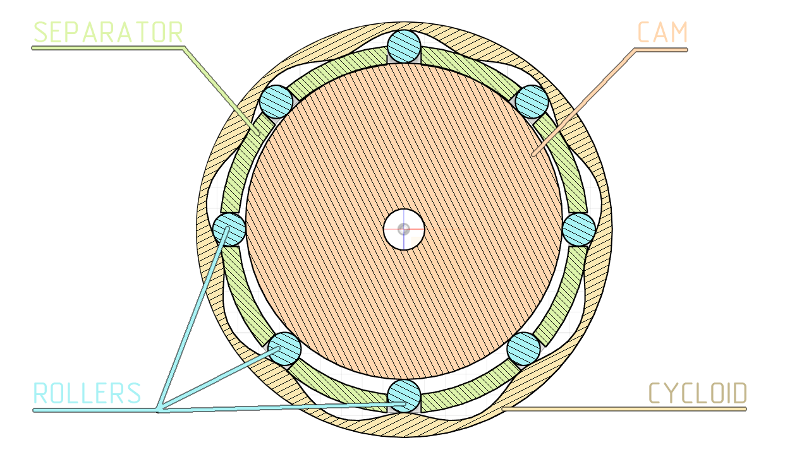

# fusion-360-wave-drive-with-roller-elements

Addon for fusion 360.
Creates a wave drive with intermediate rolling elements. 
Based on this script:
https://codeberg.org/TrashRobotics/BallsWaveGearingGenerator/src/branch/main/calc_vptc.py

## Installation guide

Just clone the repository into
<u>%USER_HOME%/AppData/Roaming/Autodesk/Autodesk Fusion 360/API/AddIns/</u>
directory and turn on the addon in addon's settings menu in Fusion 360.

## Parameters

- **roller diameter** - diameter of rolling elements (balls or rollers)

- **rollers number** - number of rolling elements.
  equals to reduction ratio of the reducer

- **use balls** - if checked reducer will be drawn with a balls as rolling element,
  otherwise with the cylindrical rollers

- **roller height** - height of the cylindrical rollers. Not used for balls

- **use minimal diameter** - if checked cycloid size will be automatically set to minimum possible value

- **cycloid diameter** - diameter of cycloid

- **input shaft diameter** - diameter of the input shaft

- **input plane** - plane or planar face to build drive on it

- **roller tolerance** - gap between rollers and separator